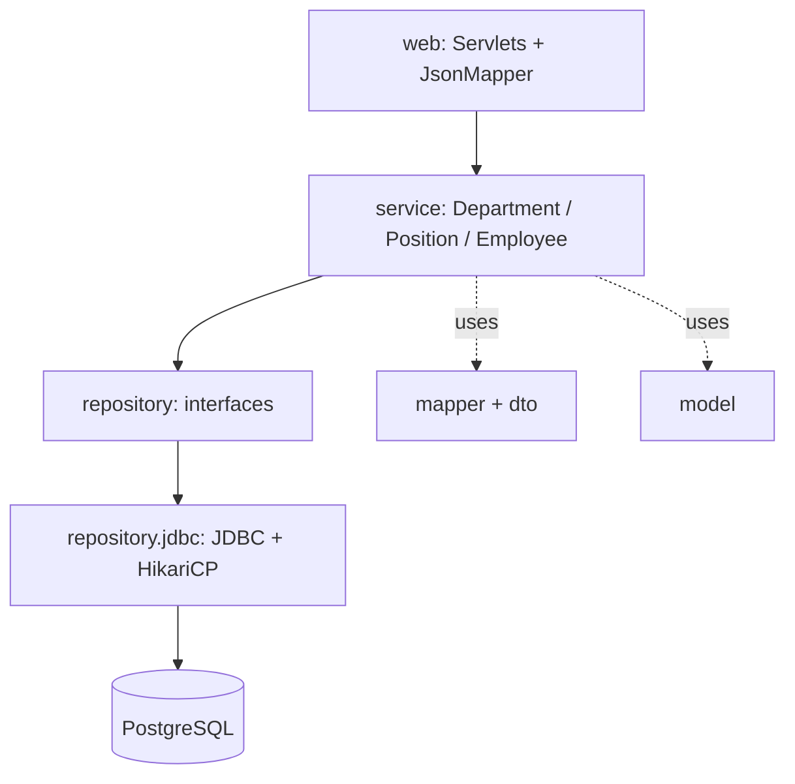
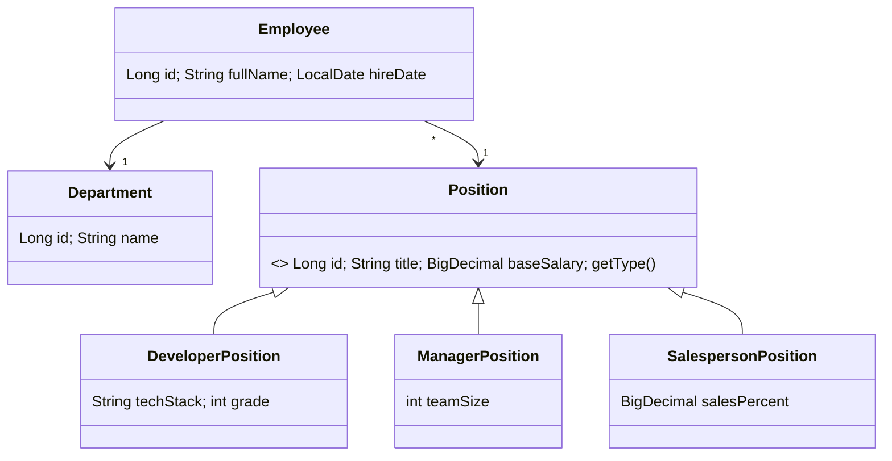
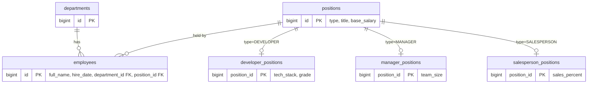
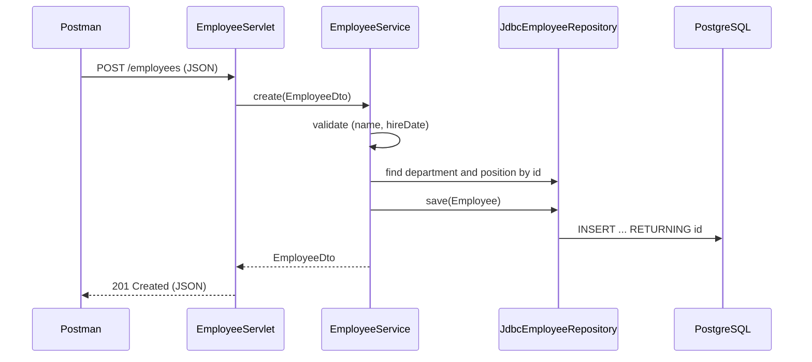
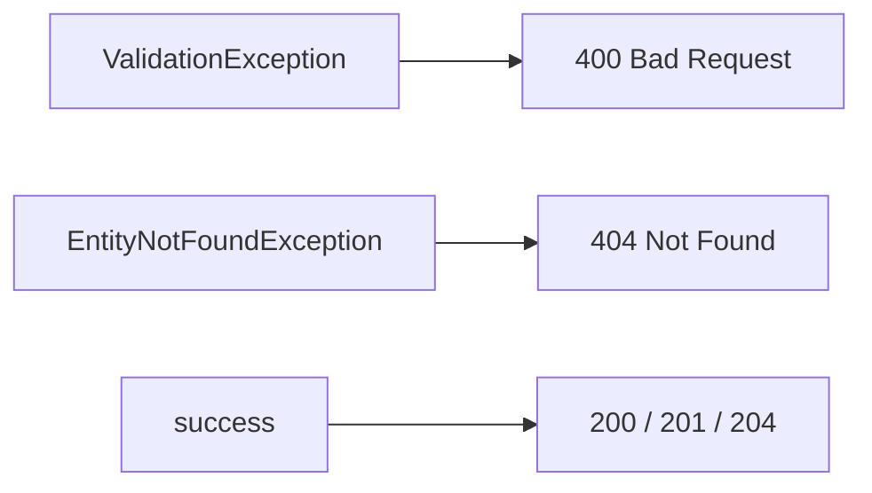
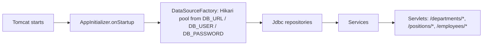
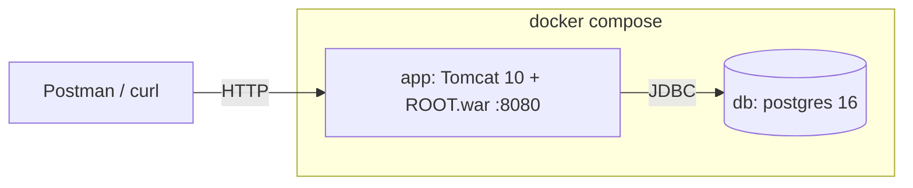
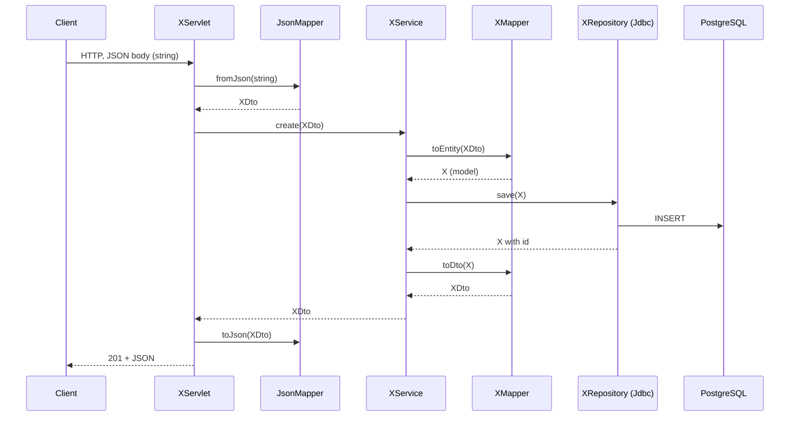

# HR System — Architecture Overview

A learning project built in three stages, each committed separately (see `git log`):

| Stage | Task | Result |
|-------|------|--------|
| 1 | Model, repositories, services, console, in-memory storage | `3d9bad4` |
| 2 | Same repository interfaces, now backed by PostgreSQL via plain JDBC (no JPA/ORM) | `92a5ccf` |
| 3 | Console replaced by servlets, deployed to Tomcat (tested via Postman/curl) | `ef190a0` |

Every unit follows TDD: a `test:` commit (failing) followed by a `feat:` commit.

## 1. Layers

Each layer depends only on the one below it. Repositories are interfaces, which is why swapping in-memory for JDBC in stage 2 did not touch services.

## 2. Domain model

`Position` is a `sealed` hierarchy: three allowed subtypes, each with its own extra fields.

## 3. Database schema

Positions use **table-per-subclass**: a common `positions` table plus one table per subtype, linked by `position_id` (PK = FK, `ON DELETE CASCADE`). The `type` column tells the repository which subtype table to read.

Schema file: `src/main/resources/db/schema.sql` (applied manually, no migration framework).

## 4. Request flow (POST /employees)

## 5. Error handling

Services throw domain exceptions; servlets translate them to HTTP codes.

Body of an error: `{"error": "<message>"}`.

## 6. Startup and wiring

There is no DI framework. Tomcat discovers `AppInitializer` through `META-INF/services/jakarta.servlet.ServletContainerInitializer`, and it wires everything by hand.

## 7. Deployment

- `make up` — build and start both containers
- `make test` — run all tests in Docker (integration tests use Testcontainers with a real Postgres)
- `make down` — stop and drop containers and the DB volume
- `make db-shell` — open `psql` in the DB container

## 8. HTTP API

| Resource | Endpoints |
|----------|-----------|
| `/departments` | `GET` list, `GET /{id}`, `POST`, `DELETE /{id}` |
| `/positions` | `GET` list, `GET /{id}`, `POST`, `DELETE /{id}`; `type` in body: `DEVELOPER` / `MANAGER` / `SALESPERSON` |
| `/employees` | `GET` list, `GET /{id}`, `POST`, `PUT /{id}`, `DELETE /{id}`; body takes `fullName`, `hireDate`, `departmentId`, `positionId` |

Services also expose `getByDepartment` / `getByPositionType` for employees, but no servlet route uses them yet.

## 9. Tests

| Kind | What | Tools |
|------|------|-------|
| Unit | model, mappers, services | JUnit 5, Mockito |
| Integration | JDBC repositories against a real DB | Testcontainers (Postgres) |

## 10. Generic flow and where mappers fit

`X` stands for any entity (Department, Position, Employee). Data changes shape at each boundary: JSON string → DTO → model → DB rows, and back.

| Step | Where | What | Format |
|------|-------|------|--------|
| 1-2 | `XServlet` + `JsonMapper.fromJson` | Read body, parse JSON | string → **DTO** |
| 3 | `XService` | Validation, business rules | DTO |
| 4 | `XMapper.toEntity` | Build the model object | **DTO → model** |
| 5 | `JdbcXRepository.save` | SQL `INSERT`, sets `id` | model → DB rows |
| 6 | `XMapper.toDto` | Build the response object | **model → DTO** |
| 7-8 | `JsonMapper.toJson` + `XServlet.writeJson` | Serialize, set status | DTO → string |

Read flow (`GET /xs/{id}`) is the same without steps 1-4: `findById` → `XMapper.toDto` → JSON.

**Two different mappers:**
- `JsonMapper` (`web/`) converts JSON string ↔ DTO (HTTP boundary).
- `XMapper` (`mapper/`) converts DTO ↔ model (service ↔ domain boundary).

**Employee is a special case.** `EmployeeMapper` has only `toDto`: an `EmployeeDto` carries `departmentId` / `positionId`, but a model needs real `Department` / `Position` objects. So `EmployeeService.create` loads them from the repositories and calls `new Employee(...)` itself; the mapper is used only on the way out.
