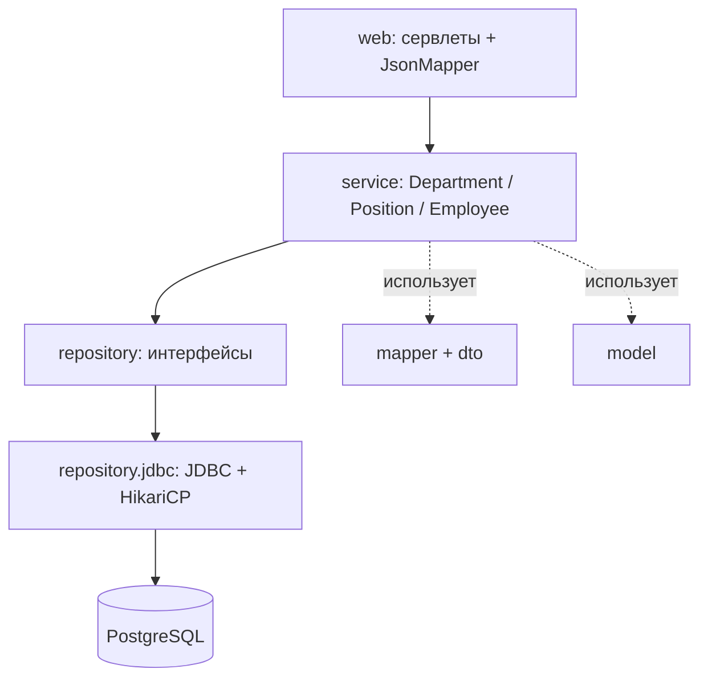
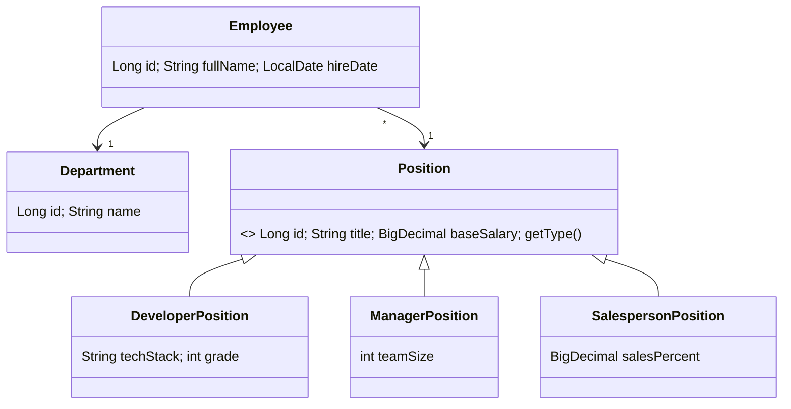
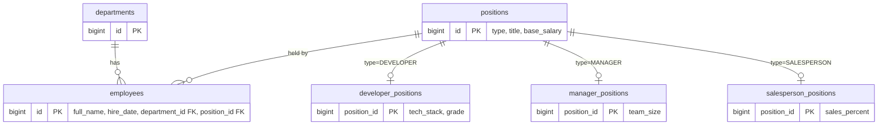
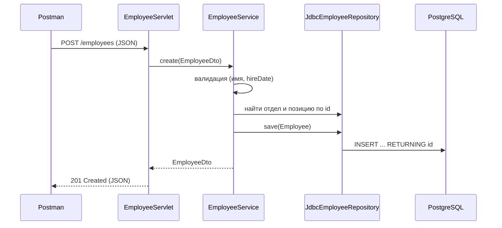
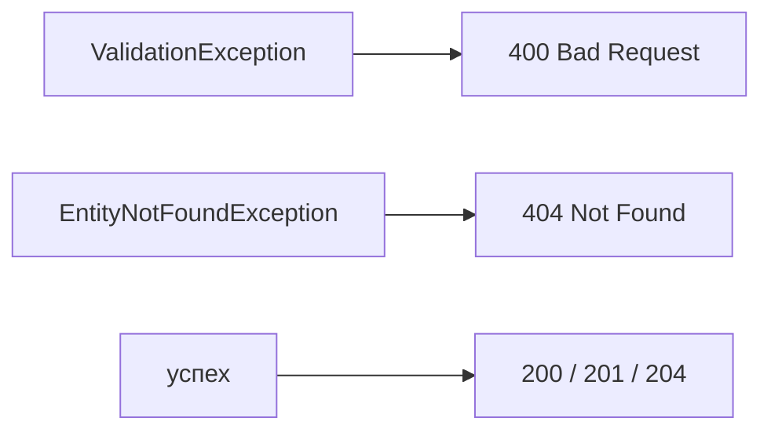
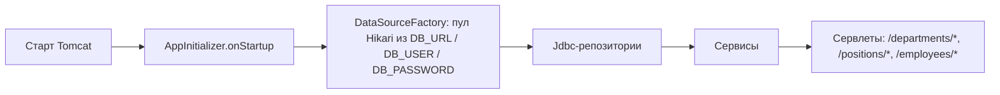
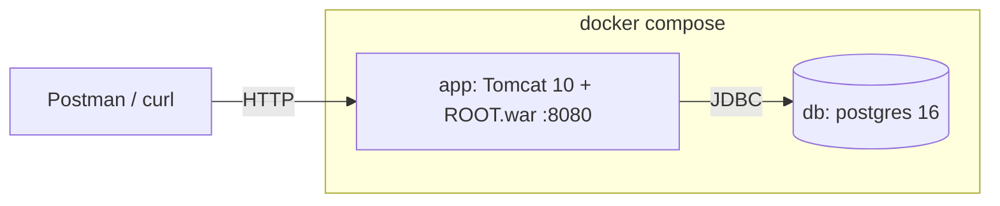
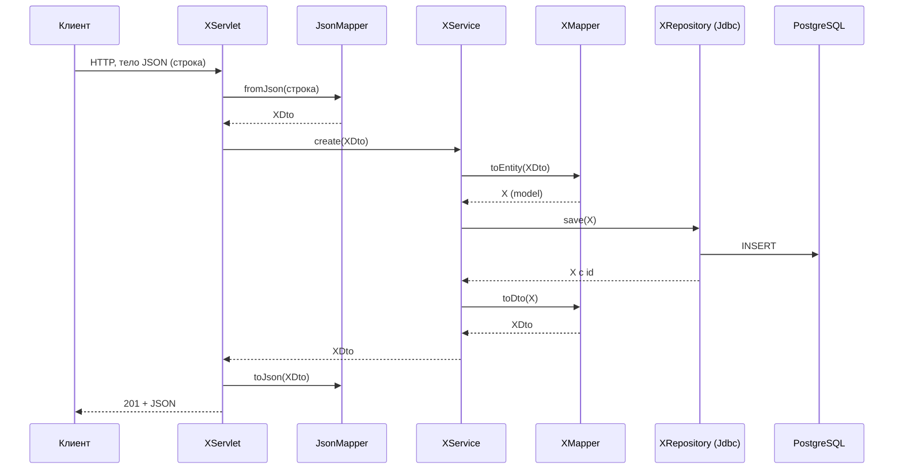

# HR System — обзор архитектуры

Учебный проект в три стадии, каждая закоммичена отдельно (см. `git log`):

| Стадия | Задание | Результат |
|--------|---------|-----------|
| 1 | Модель, репозитории, сервисы, консоль, хранение в памяти | `3d9bad4` |
| 2 | Те же интерфейсы репозиториев, но реализация в PostgreSQL через чистый JDBC (без JPA/ORM) | `92a5ccf` |
| 3 | Консоль заменена сервлетами, деплой в Tomcat (проверка через Postman/curl) | `ef190a0` |

Каждый юнит сделан по TDD: коммит `test:` (красный) → коммит `feat:`.

## 1. Слои

Каждый слой зависит только от нижележащего. Репозитории — интерфейсы, поэтому замена in-memory на JDBC на стадии 2 не затронула сервисы.

## 2. Модель предметной области

`Position` — `sealed`-иерархия: три разрешённых подтипа, у каждого свои поля.

## 3. Схема БД

Позиции хранятся по схеме **table-per-subclass**: общая таблица `positions` и по одной таблице на подтип, связанные через `position_id` (PK = FK, `ON DELETE CASCADE`). Колонка `type` подсказывает репозиторию, из какой таблицы подтипа читать.

Файл схемы: `src/main/resources/db/schema.sql` (применяется вручную, фреймворка миграций нет).

## 4. Поток запроса (POST /employees)

## 5. Обработка ошибок

Сервисы бросают доменные исключения, сервлеты переводят их в HTTP-коды.

Тело ошибки: `{"error": "<сообщение>"}`.

## 6. Запуск и сборка зависимостей

DI-фреймворка нет. Tomcat находит `AppInitializer` через `META-INF/services/jakarta.servlet.ServletContainerInitializer`, и тот вручную собирает всё приложение.

## 7. Деплой

- `make up` — собрать и поднять оба контейнера
- `make test` — прогнать все тесты в Docker (интеграционные — через Testcontainers с настоящим Postgres)
- `make down` — остановить контейнеры и удалить volume с данными БД
- `make db-shell` — открыть `psql` в контейнере с БД

## 8. HTTP API

| Ресурс | Эндпоинты |
|--------|-----------|
| `/departments` | `GET` список, `GET /{id}`, `POST`, `DELETE /{id}` |
| `/positions` | `GET` список, `GET /{id}`, `POST`, `DELETE /{id}`; `type` в теле: `DEVELOPER` / `MANAGER` / `SALESPERSON` |
| `/employees` | `GET` список, `GET /{id}`, `POST`, `PUT /{id}`, `DELETE /{id}`; в теле `fullName`, `hireDate`, `departmentId`, `positionId` |

Сервис сотрудников также умеет `getByDepartment` / `getByPositionType`, но ни один маршрут сервлета их пока не использует.

## 9. Тесты

| Вид | Что проверяет | Инструменты |
|-----|---------------|-------------|
| Unit | модель, мапперы, сервисы | JUnit 5, Mockito |
| Интеграционные | JDBC-репозитории на настоящей БД | Testcontainers (Postgres) |

## 10. Общий flow и роль мапперов

`X` — любая сущность (Department, Position, Employee). На каждой границе данные меняют форму: строка JSON → DTO → модель → строки БД, и обратно.

| Шаг | Где | Что происходит | Формат |
|-----|-----|----------------|--------|
| 1-2 | `XServlet` + `JsonMapper.fromJson` | Читает тело, разбирает JSON | строка → **DTO** |
| 3 | `XService` | Валидация, бизнес-правила | DTO |
| 4 | `XMapper.toEntity` | Собирает объект модели | **DTO → model** |
| 5 | `JdbcXRepository.save` | SQL `INSERT`, проставляет `id` | model → строки БД |
| 6 | `XMapper.toDto` | Собирает объект для ответа | **model → DTO** |
| 7-8 | `JsonMapper.toJson` + `XServlet.writeJson` | Сериализация, статус | DTO → строка |

Чтение (`GET /xs/{id}`) — то же самое без шагов 1-4: `findById` → `XMapper.toDto` → JSON.

**Два разных маппера:**
- `JsonMapper` (`web/`) переводит строку JSON ↔ DTO (граница HTTP).
- `XMapper` (`mapper/`) переводит DTO ↔ модель (граница сервис ↔ домен).

**Employee — особый случай.** У `EmployeeMapper` есть только `toDto`: в `EmployeeDto` лежат `departmentId` / `positionId`, а модели нужны реальные `Department` / `Position`. Поэтому `EmployeeService.create` сам достаёт их из репозиториев и вызывает `new Employee(...)`; маппер нужен только на выходе.
